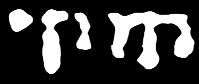
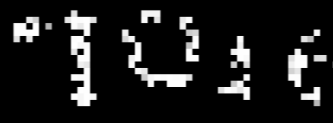

# Vesuvius Challenge - Grand Prize Submission

_Elian Rafael Dal Prá, Sean Johnson, Leonardo Scabini, Raí Fernando Dal Prá, João Vitor Brentigani Torezan, Daniel Baldin Franceschini, Bruno Pereira Kellm, Marcelo Soccol Gris, Odemir Martinez Bruno_


## Overview

Note: we will soon update this repository with a detailed explanation about our approach and methods.

Our submission consists of two parts. The first one, in the directory ```first-part```, is a rougher approach to ink detection, where each 2D 64x64 output patch is classified into ink or no-ink with one scalar value only: binary classification on patches. This was done to avoid the output of shapes during inference. Then, we created a new training dataset based on this model predictions and used an already verified method, First Letters' Youssef's model, to improve the readability of our previous predictions; this is the content of the ```second-part``` directory. 

## Our Approach

Our main objective was to detect regions with or without ink at the papyrus's segments using machine learning and to form letters without relying on the output of any shape during inference. To achieve this, we've done classification on square patches of size $32\times 64\times64$ instead of the more usual segmentation approach.

The rationale behind this comes from the difficulty of creating an accurate training dataset. The _crackle_ finding by Casey Handmer pivoted a new way at looking at segments. This was the basis for our classification model. We created two $2D$ training datasets: one containing crackle signals and another without it (from middle columns and in between rows). We grabbed $64\times 64$ tiles containing more than $50\%$ ink to represent ink and $64\times 64$ tiles without ink to classify as no ink. We trained a modified semantic segmentation model to make the binary classification (as explained above). In this way, we have one output of an unique number, a "probability" of a square containing substantial ink, for a whole $64\times 64$ tile. In this case, each input of size $32\times 64\times 64$, where $32$ represents the middle $32$ layers of a segment, had a $1D$ scalar output. Then, for our predictions, we used stride $32$ on inference with each $32\times 32$ tile having the mean "probability" value of it containing substantial ink. But, now, why did we do this way?

Since we did not find any more significant sign of ink beyond crackle in the segments, we did not feel confident in predicting any kind of shape with our model, as we could only label the crackles signs without knowing if we have anything else (also, their boundaries are not easy to decide on too). But, classifying small subvolumes of $32\times 64\times 64$ with ink "probabilities" gives us a natural way of forming shapes, since the letter borders (less ink signal in these subvolumes) should appear lighter than their interiors. This also contributes to less hallucinations, since we aren't doing predictions on a pixel basis and generating forms, which we found it can more easily occur with pure semantic segmentation models, especially the ones with larger contexts (for instance, on the $512\times 512$ input and output size model we tested and showed below).

<p align="center">
     &emsp; &emsp; &emsp; 
</p>


On the left figure, a $512\times 512$ context window semantic segmentation model and on the right figure a $64\times 64$ classification model at the same segment region. We can see that the semantic segmentation model merge shapes while the model with small context window cannot do that, it cannot do anything like this even on the $64\times 64$ output, since it's only one scalar value, thus, having a more accurate reading as a whole.

To avoid this at any scale, we preferred a model with more noise, but a more accurate representation of the papyrus itself. The confidence is given by the pixel intensity and letters shapes can be formed together easily where the signal is strong. We hope this can help with the identification and the certainty given to the letters by papyrologists. The "noise" can be attributed to the use of $32$ layers and the structure of the segments itself, but we noted that this gave us the best results and does not influence on the ability of most of the reading, since the ink signal will still be stronger above the noise and it can be ignored in regards to text otherwise; not only that, it can even increase the shape confidence (as the context window is very small with only one output). We ran the predictions with stride $32$, so we have $32\times 32$ sized tiles representing the average of two one scalar "probability" output. 
 
To confirm and improve the readability of our results, we did augmentation on this model output and trained Youssef's model with them (which was already verified). The predictions verified our results.

In conclusion, we saw many examples of ink detection being possible on cleaner segments. Because of this, our approach was to try to get a model that was capable of giving a high certainty in regards to what can actually be found in the segments, avoiding hallucinations at our best and giving an accurate way of asserting letters in them.
